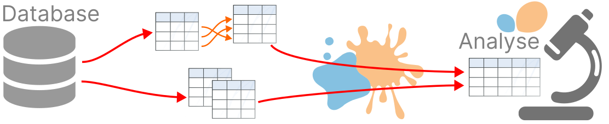

:html_theme.sidebar_secondary.remove:

.. title:: skrub

.. toctree::
   :maxdepth: 2

.. currentmodule:: skrub

.. Landing banner (similar to sklearn's)
.. raw:: html
   

     

       

         

           <h1 class="sk-landing-header text-white text-monospace">skrub</h1>
           <h4 class="sk-landing-subheader text-white font-italic mb-3">Machine Learning on dirty tables in Python</h4>
           <a class="btn sk-landing-btn mb-1" href="CHANGES.html" role="button">Recent changes</a>
           <a class="btn sk-landing-btn mb-1" href="https://github.com/skrub-data/skrub" role="button">GitHub</a>
         

         

           <ul class="sk-landing-header-body">
             <li>Built for scikit-learn</li>
             <li>Robust to dirty data</li>
             <li>Easy machine learning on pandas dataframes</li>
           </ul>
         

       

     

   

.. rst-class:: h4 text-center font-weight-light my-4

   Skrub: an open-source Python package for prepping tables for machine learning,
   from typing, relating, aggregating, fixing errors, and more.

|

.. toctree::
   :hidden:

   install
   documentation
   api
   auto_examples/index
