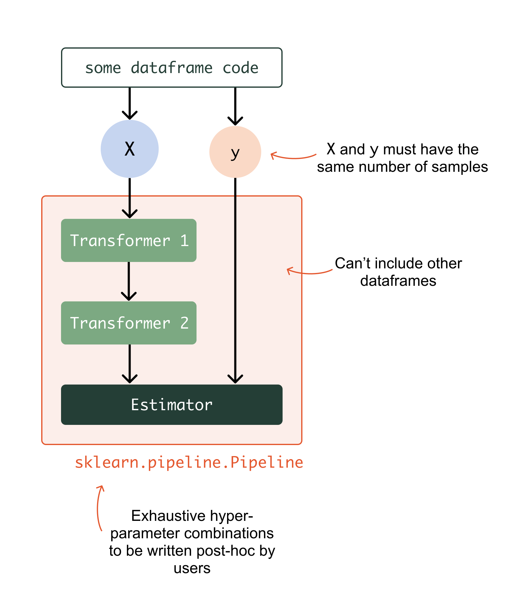
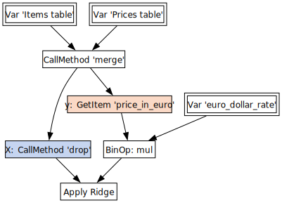

.. currentmodule:: skrub

.. _user_guide_data_ops_vs_alternatives:

How do skrub Data Ops differ from the alternatives?
~~~~~~~~~~~~~~~~~~~~~~~~~~~~~~~~~~~~~~~~~~~~~~~~~~~~

Skrub DataOps and scikit-learn :class:`sklearn.pipeline.Pipeline`
====================================================================

Scikit-learn pipelines represent a linear sequence of transformations on one
table with a fixed number of rows.

Skrub DataOps, on the other hand, can manipulate any number of variables.
The transformation they perform is not a linear sequence but any Directed
Acyclic Graph of computations. Take the following example, where our task is to predict
item price in dollars:

- Here we use three input variables: two tables ("Items" and "Prices") and a
  float ("euro_dollar_rate").
- For this regression task, we have declared which intermediary step can be
  considered as the design matrix X (shown in blue) and as the target y
  (shown in orange).
- Akin to scikit-learn pipelines, we apply an estimator (Ridge) at the end of the
  processing.

The rest of this user guide will detail how the DataOps work.

Skrub DataOps and orchestrators like Apache Airflow
===================================================================

Skrub pipelines are not an `orchestrator <https://huyenchip.com/2021/09/13/data-science-infrastructure.html#workflow>`_
and do not offer capabilities for scheduling runs or provisioning resources and
environments. Instead, they are a generalization of scikit-learn pipelines, which
can still be used within an orchestrator.

Skrub DataOps and other Skrub objects, like :func:`~skrub.tabular_pipeline`
===============================================================================

Skrub DataOps are built to maximize flexibility in the construction of complex
pre-processing and machine learning pipelines. On the other hand, the main intent
of Skrub objects such as :func:`~skrub.tabular_pipeline` and
:class:`~skrub.TableVectorizer` is to provide interfaces that for common
pre-processing tasks, and simple and robust baselines for
machine learning. As a result, these objects are more opinionated and
less flexible than DataOps.

However, it is possible to combine DataOps and regular Skrub and scikit-learn
transformers to improve their flexibility, particularly in multi-table scenarios.

Can I use library "x" with Skrub DataOps?
==========================================

Yes, Skrub DataOps are designed to be "transparent", so that any method used by
the underlying data structures (e.g., Pandas or Polars) can be accessed directly:
check :ref:`user_guide_direct_access_ref` for more details.
All DataOps-specific operations are available through the ``.skb`` attribute,
which provides access to the DataOps namespace. Other library-specific methods
are available directly from the DataOp object, as if it were a regular object
(like a Pandas or Polars DataFrame or Series).
