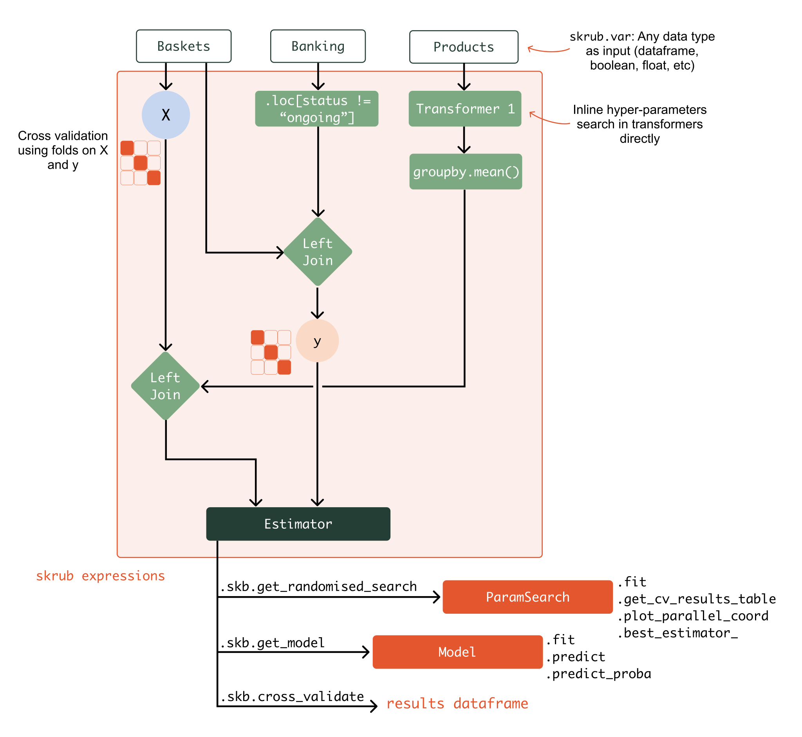

.. _skrub_pipeline:

================================================================
Skrub Pipeline: fit, tune, and validate arbitrary data wrangling
================================================================

.. currentmodule:: skrub

Introduction
~~~~~~~~~~~~

Skrub provides an easy way to build complex, flexible machine learning pipelines.
There are several needs that are not easily addressed with standard scikit-learn
tools such as :class:`~sklearn.pipeline.Pipeline` and
:class:`~sklearn.compose.ColumnTransformer`, and for which a Skrub pipeline offers a
solution:

- **Multiple tables**: We often have several tables of different shapes (for
  example, "Customers", "Orders", and "Products" tables) that need to be
  processed and assembled into a design matrix ``X``. The target ``y`` may also
  be the result of some data processing. Standard scikit-learn estimators do not
  support this, as they expect right away a single design matrix ``X`` and a
  target array ``y``, with one row per observation.
- **DataFrame wrangling**: Performing typical DataFrame operations such as
  projections, joins, and aggregations should be possible and allow leveraging
  the powerful and familiar APIs of `Pandas <https://pandas.pydata.org>`_ or
  `Polars <https://docs.pola.rs/>`_.
- **Hyperparameter tuning**: Choices of estimators, hyperparameters, and even
  the pipeline architecture can be guided by validation scores. Specifying
  ranges of values to explore for each choice should be easy, but doing so
  separately from the model (as in
  :class:`~sklearn.model_selection.GridSearchCV`) is difficult in complex
  pipelines.
- **Iterative development**: Building a pipeline step by step while inspecting
  intermediate results allows for a short feedback loop and early discovery of
  errors.

What is the difference with scikit-learn :class:`~sklearn.pipeline.Pipeline`?
=============================================================================

Scikit-learn pipelines represent a linear sequence of transformations on one
table with a fixed number of rows.

.. image:: _static/sklearn_pipeline.svg
    :width: 500

Skrub expressions, on the other hand, can manipulate any number of variables.
The transformation they perform is not a linear sequence but any Directed
Acyclic Graph of computations.

What is the difference with orchestrators like Apache Airflow?
==============================================================

Skrub pipelines are not an `orchestrator <https://huyenchip.com/2021/09/13/data-science-infrastructure.html#workflow>`_
and do not offer capabilities for scheduling runs or provisioning resources and
environments. Instead, they are a generalization of scikit-learn pipelines, which can still be used within an orchestrator.

.. _expressions:

Skrub expressions
~~~~~~~~~~~~~~~~~

Skrub pipelines are built using special objects that represent intermediate
results in a computation. These objects record the operations performed on them
(such as applying operators or calling methods) allowing the entire computation
graph to be retrieved later as a machine learning pipeline that can be fitted
and applied to unseen data.

Because these Skrub objects encapsulate computations that can be evaluated to produce
results, we call them **expressions**.

The simplest expressions are **variables**, which represent inputs to our machine
learning pipeline—such as "products" or "customers" tables or dataframes.

These variables can be combined using operators and function calls to build more
complex expressions. The pipeline is constructed implicitly as we apply these
operations, rather than by specifying an explicit list of transformations.

We start by declaring inputs:

>>> import skrub

>>> a = skrub.var("a")
>>> b = skrub.var("b")

We then apply transformations, composing more complex expressions.

>>> c = a + b
>>> c
<BinOp: add>

Finally, we can evaluate an expression, by passing a dictionary mapping input
(variable) names to values:

>>> c.skb.eval({"a": 10, "b": 6})
16

As shown above, the special ``.skb`` attribute allows to interact with the expression
object itself, and :meth:`.skb.eval() <Expr.skb.eval>` evaluates an expression.

Access to any other attribute than ``.skb`` is simply added as a new operation
in the computation graph:

>>> d = c.capitalize()
>>> d.skb.eval({"a": "hello, ", "b": "world!"})
'Hello, world!'

Finally, we can get a pipeline that can be fitted and applied to data.

>>> pipeline = c.skb.get_pipeline()
>>> pipeline.fit_transform({"a": 10, "b": 7})
17

Previews
~~~~~~~~

As we saw above, we can call :meth:`.skb.eval() <Expr.skb.eval>` with a dictionary of
bindings to compute the result of a pipeline. However, to make interactive
development easier without having to call ``eval()`` repeatedly, Skrub provides a
way to preview the result of an expression. When creating a variable, if we pass
a value along with its name, Skrub will use that value to compute and preview
the result of the expression.

>>> a = skrub.var("a", 10) # we pass the value 10 in addition to the name
>>> b = skrub.var("b", 6)
>>> c = a + b
>>> c  # now the display of c includes a preview of the result
<BinOp: add>
Result:
―――――――
16

Note that seeing results for the values we provided does *not* change the fact
that we are building a pipeline that we want to reuse, not just computing the
result for a fixed input. The displayed result is only preview of the output on
one example dataset.

>>> c.skb.eval({"a": 3, "b": 2})
5

Composing expressions
~~~~~~~~~~~~~~~~~~~~~

We create complex expressions by applying operations to simpler ones (like
variables). As the operations are replayed on the actual data when the pipeline
runs, we can use (most of) the operations that are valid for the types we will
pass to the pipeline.

Suppose we want to process dataframes that look like this:

>>> import pandas as pd

>>> orders_df = pd.DataFrame(
...     {
...         "item": ["pen", "cup", "pen", "fork"],
...         "price": [1.5, None, 1.5, 2.2],
...         "qty": [1, 1, 2, 4],
...     }
... )
>>> orders_df
   item  price  qty
0   pen    1.5    1
1   cup    NaN    1
2   pen    1.5    2
3  fork    2.2    4

We can create a skrub variable to represent that input:

>>> orders = skrub.var("orders", orders_df)

Because we know that a dataframe will be provided as input to the computation, we
can manipulate ``orders`` as if it were a regular dataframe.

We can access its attributes:

>>> orders.columns
<GetAttr 'columns'>
Result:
―――――――
Index(['item', 'price', 'qty'], dtype='object')

Accessing items, indexing, slicing:

>>> orders["item"].iloc[1:]
<GetItem slice(1, None, None)>
Result:
―――――――
1     cup
2     pen
3    fork
Name: item, dtype: object

We can apply operators:

>>> orders["price"] * orders["qty"]
<BinOp: mul>
Result:
―――――――
0    1.5
1    NaN
2    3.0
3    8.8
dtype: float64

We can call methods:

>>> orders.assign(total=orders["price"] * orders["qty"])
<CallMethod 'assign'>
Result:
―――――――
   item  price  qty  total
0   pen    1.5    1    1.5
1   cup    NaN    1    NaN
2   pen    1.5    2    3.0
3  fork    2.2    4    8.8

Note that the original ``orders`` pipeline is not modified by the operations
above. Instead, each operation creates a new expression. Expressions cannot be
modified in-place, all operations that we apply must produce a new value. We
discuss this in more detail in a
:ref:`later section <user_guide_deferred_evaluation_ref>`.

Applying machine-learning estimators
~~~~~~~~~~~~~~~~~~~~~~~~~~~~~~~~~~~~

As mentioned above, in addition to those usual operations, the expressions
have a special attribute: ``.skb``, which gives access to the methods and objects
provided by Skrub. A particularly important one is
:meth:`.skb.apply() <Expr.skb.apply>`, which allows to add scikit-learn estimators to the pipeline.

>>> orders.skb.apply(skrub.TableVectorizer())
<Apply TableVectorizer>
Result:
―――――――
   item_cup  item_fork  item_pen  price  qty
0       0.0        0.0       1.0    1.5  1.0
1       1.0        0.0       0.0    NaN  1.0
2       0.0        0.0       1.0    1.5  2.0
3       0.0        1.0       0.0    2.2  4.0

It is also possible to apply a transformer to a subset of the columns:

>>> vectorized_orders = orders.skb.apply(
...     skrub.StringEncoder(n_components=3), cols="item"
... )
>>> vectorized_orders # doctest: +SKIP
<Apply StringEncoder>
Result:
―――――――
         item_0        item_1        item_2  price  qty
0  9.999999e-01  1.666000e-08  4.998001e-08    1.5    1
1 -1.332800e-07 -1.199520e-07  1.000000e+00    NaN    1
2  9.999999e-01  1.666000e-08  4.998001e-08    1.5    2
3  3.942477e-08  9.999999e-01  7.884953e-08    2.2    4

Importantly, when we apply such operations, the returned value
encapsulates the entire computation that produces the result we see. We are not only
interested in the output for the example values we provided: we are building a machine
learning pipeline that can be fitted and applied to unseen data.

We can retrieve the pipeline with :meth:`.skb.get_pipeline()
<Expr.skb.get_pipeline>`, fit it on the data we initially provided, and then
apply it to new data:

>>> pipeline = vectorized_orders.skb.get_pipeline(fitted=True)
>>> new_orders = pd.DataFrame({"item": ["fork"], "price": [2.2], "qty": [5]})
>>> pipeline.transform({"orders": new_orders}) # doctest: +SKIP
         item_0  item_1        item_2  price  qty
0  5.984116e-09     1.0 -1.323546e-07    2.2    5

.. _user_guide_deferred_evaluation_ref:

Deferred evaluation
~~~~~~~~~~~~~~~~~~~

An expression represents a computation that has not been executed yet, and will
only be triggered when we call :meth:`.skb.eval() <Expr.skb.eval>`, or when we
create the pipeline with :meth:`.skb.get_pipeline() <Expr.skb.get_pipeline>` and
call one of its methods such as ``fit()``.

This means we cannot use standard Python control flow statements such as ``if``,
``for``, ``with``, etc. with expressions, because those constructs would execute
immediately.

>>> for column in orders.columns:
...     pass
Traceback (most recent call last):
    ...
TypeError: This object is an expression that will be evaluated later, when your pipeline runs. So it is not possible to eagerly iterate over it now.

We get an error because the ``for`` statement tries to iterate immediately
over the columns. However, ``orders.columns`` is not an actual list of
columns: it is a Skrub expression that will produce a list of columns, later,
when we run the computation.

This remains true even if we have provided a value for ``orders`` and we can
see a result for that value:

>>> orders.columns
<GetAttr 'columns'>
Result:
―――――――
Index(['item', 'price', 'qty'], dtype='object')

The "result" we see is an *example* result that the computation produces for the
data we provided. But we want to fit our pipeline and apply it to different
datasets, for which it will return a new object every time. So even if we see a
preview of the output on the data we provided, ``orders.columns`` still
represents a future computation that remains to be evaluated.

Therefore, we must delay the execution of the ``for`` statement until the computation
actually runs and ``orders.columns`` has been evaluated.

We can achieve this by defining a function that contains the control flow logic
we need, and decorating it with :func:`deferred`. This decorator defers the execution
of the function: when we call it, it does not run immediately. Instead, it returns
a Skrub expression that wraps the function call. The original function is only
executed when the expression is evaluated.

>>> @skrub.deferred
... def with_upper_columns(df):
...     new_columns = [c.upper() for c in df.columns]
...     return df.set_axis(new_columns, axis="columns")

>>> with_upper_columns(orders)
<Call 'with_upper_columns'>
Result:
―――――――
   ITEM  PRICE  QTY
0   pen    1.5    1
1   cup    NaN    1
2   pen    1.5    2
3  fork    2.2    4

When the computation runs, ``orders`` will be evaluated first and the result (an
actual dataframe) will be passed as the ``df`` argument to our function.

When the first argument to our function is a skrub expression, rather than
applying ``deferred`` and calling the function as shown above we can use
:meth:`.skb.apply_func() <Expr.skb.apply_func>`:

>>> def with_upper_columns(df):
...     new_columns = [c.upper() for c in df.columns]
...     return df.set_axis(new_columns, axis="columns")

>>> orders.skb.apply_func(with_upper_columns)
<Call 'with_upper_columns'>
Result:
―――――――
   ITEM  PRICE  QTY
0   pen    1.5    1
1   cup    NaN    1
2   pen    1.5    2
3  fork    2.2    4

:func:`deferred` is useful not only for our own functions, but also when we
need to call module-level functions from a library. For example, to delay the
loading of a CSV file, we could write something like:

>>> csv_path = skrub.var("csv_path")
>>> data = skrub.deferred(pd.read_csv)(csv_path)

Another consequence of the fact that expressions are evaluated lazily (we are
building a pipeline, not immediately computing a single result), any
transformation that we apply must not modify its input, but leave it unchanged
and return a new value.

Consider the transformers in a scikit-learn pipeline: each computes a new
result without modifying its input.

>>> orders['total'] = orders['price'] * orders['qty']
Traceback (most recent call last):
    ...
TypeError: Do not modify an expression in-place. Instead, use a function that returns a new value. This is necessary to allow chaining several steps in a sequence of transformations.
For example if df is a pandas DataFrame:
df = df.assign(new_col=...) instead of df['new_col'] = ...

Note the suggestion in the error message: using :meth:`pandas.DataFrame.assign`.
When we do need assignments or in-place transformations, we can put them in a
:func:`deferred` function. But we should make a (shallow) copy of the inputs and
return a new value.

Finally, there are other situations where using :func:`deferred` can be helpful:

- When we have many nodes in our graph and want to collapse a sequence of steps into
  a single function call that appears as a single node.
- When certain function calls need to be deferred until the full computation
  runs, because they depend on the runtime environment, or on objects that
  cannot be pickled with the rest of the computation graph (for example, opening
  and reading a file).

.. rubric:: Examples

- See :ref:`example_expressions_intro` for an example of skrub pipelines using
  expressions on dataframes.
- See :ref:`example_tuning_pipelines` for an example of hyper-parameter tuning using
  skrub pipelines.
