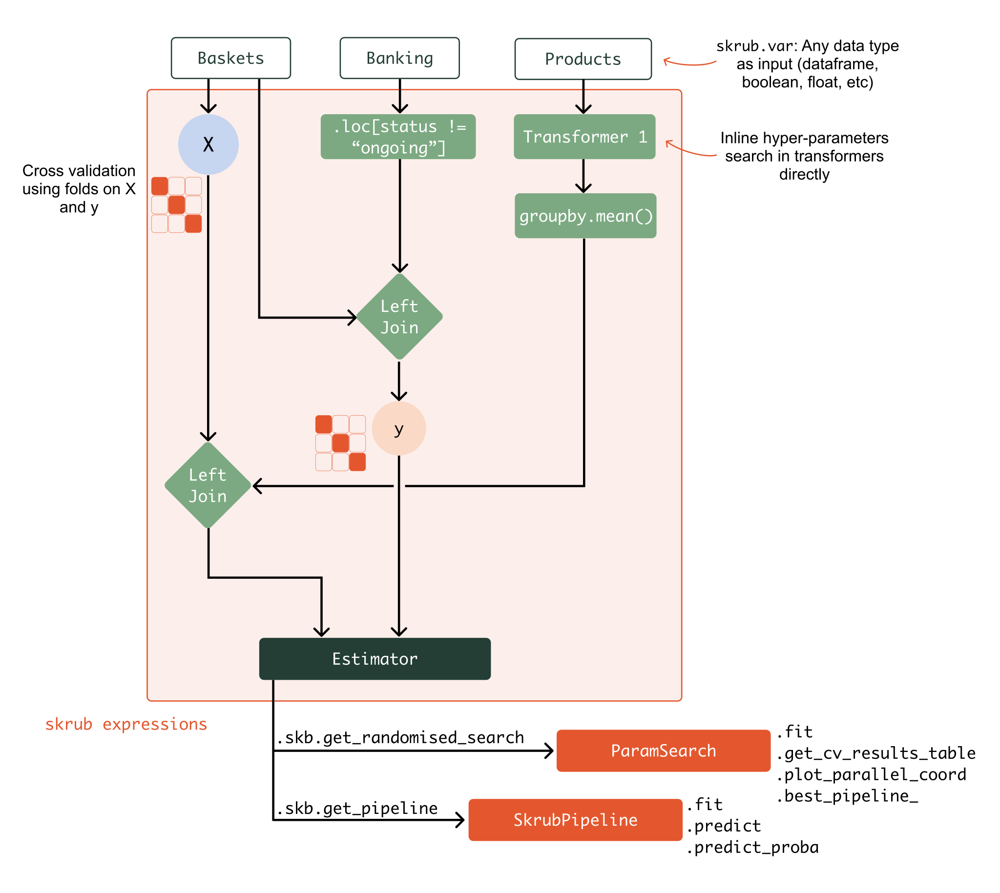

.. _userguide_data_ops:

================================================================
Skrub DataOps: fit, tune, and validate arbitrary data wrangling
================================================================

.. currentmodule:: skrub

What are Skrub DataOps, and why do we need them?
==================================================

Skrub provides an easy way to build complex, flexible machine learning pipelines.
There are several needs that are not easily addressed with standard scikit-learn
tools such as :class:`~sklearn.pipeline.Pipeline` and
:class:`~sklearn.compose.ColumnTransformer`, and for which the Skrub DataOps offer
a solution:

- **Multiple tables**: We often have several tables of different shapes (for
  example, "Customers", "Orders", and "Products" tables) that need to be
  processed and assembled into a design matrix ``X``. The target ``y`` may also
  be the result of some data processing. Standard scikit-learn estimators do not
  support this, as they expect right away a single design matrix ``X`` and a
  target array ``y``, with one row per observation.
- **DataFrame wrangling**: Performing typical DataFrame operations such as
  projections, joins, and aggregations should be possible and allow leveraging
  the powerful and familiar APIs of `Pandas <https://pandas.pydata.org>`_ or
  `Polars <https://docs.pola.rs/>`_.
- **Hyperparameter tuning**: Choices of estimators, hyperparameters, and even
  the pipeline architecture can be guided by validation scores. Specifying
  ranges of possible values outside of the pipeline itself (as in
  :class:`~sklearn.model_selection.GridSearchCV`) is difficult in complex
  pipelines.
- **Iterative development**: Building a pipeline step by step while inspecting
  intermediate results allows for a short feedback loop and early discovery of
  errors.

How do Skrub DataOps differ from :class:`sklearn.pipeline.Pipeline`?
~~~~~~~~~~~~~~~~~~~~~~~~~~~~~~~~~~~~~~~~~~~~~~~~~~~~~~~~~~~~~~~~~~~~

Scikit-learn pipelines represent a linear sequence of transformations on one
table with a fixed number of rows.

.. image:: _static/sklearn_pipeline.svg
    :width: 500

Skrub DataOps, on the other hand, can manipulate any number of variables.
The transformation they perform is not a linear sequence but any Directed
Acyclic Graph of computations.

How do Skrub DataOps differ from orchestrators like Apache Airflow?
~~~~~~~~~~~~~~~~~~~~~~~~~~~~~~~~~~~~~~~~~~~~~~~~~~~~~~~~~~~~~~~~~~~

Skrub pipelines are not an `orchestrator <https://huyenchip.com/2021/09/13/data-science-infrastructure.html#workflow>`_
and do not offer capabilities for scheduling runs or provisioning resources and
environments. Instead, they are a generalization of scikit-learn pipelines, which can still be used within an orchestrator.

How do Skrub DataOps differ from other Skrub objects, like :func:`~skrub.tabular_pipeline`?
~~~~~~~~~~~~~~~~~~~~~~~~~~~~~~~~~~~~~~~~~~~~~~~~~~~~~~~~~~~~~~~~~~~~~~~~~~~~~~~~~~~~~~~~~~~

Skrub DataOps are built to maximize flexibility in the construction of complex
pre-processing and machine learning pipelines. On the other hand, the main intent
of Skrub objects such as :func:`~skrub.tabular_pipeline` and
:class:`~skrub.TableVectorizer` is to provide simple and robust baselines for
machine learning tasks. As a result, these objects are more opinionated and
less flexible than DataOps.

However, it is possible to combine DataOps and regular Skrub and scikit-learn
transformers to improve their flexibility, particularly in multi-table scenarios.

Can I use x/y library with Skrub DataOps?
~~~~~~~~~~~~~~~~~~~~~~~~~~~~~~~~~~~~~~~~~~~~~~~~~~~~~~~~~~~~~~~
Yes, Skrub DataOps are designed to be "transparent", so that any method used by
the underlying data structures (e.g., Pandas or Polars) can be accessed directly:
check :ref:`user_guide_direct_access_ref` for more details.

Basics of DataOps: the DataOps plan, variables, and learners
===============================================================

**DataOps** are special objects that encapsulate operations on data (such as
applying operators, or calling methods) to record the parameters so that they
can later be replayed on new data. DataOps objects can be combined into a
DataOps plan, which is a directed acyclic graph (DAG) of operations.

DataOps have a ``.skb`` attribute that provides access to the DataOps namespace,
which contains methods for evaluating the DataOps plan, exporting the plan as a
**learner**, and various other utilities. Any other operation on a DataOp that is
not part of the DataOps namespace is instead applied to the underlying data: this
allows, for example, to make use of Pandas or Polars methods if the DataOp is
encapsulating a DataFrame or Series.

The entry point of any DataOps plan is :class:`~skrub.var`,
a **variable**: a variable is an input to
our machine learning pipeline, such as a table of data, a target array, or more
generic data such as paths to files, or timestamps.

Variables can be combined using operators and function calls to build more
complex DataOps plans. The plan is constructed implicitly as we apply these
operations, rather than by specifying an explicit list of transformations.

At any point in the DataOps plan, we can export the resulting computation graph
as a **learner** with :meth:`~skrub.DataOp.skb.make_learner()`. A learner is a
special object akin to a scikit-learn estimator, but that takes as input a
dictionary of variables rather than a single design matrix ``X`` and a target array ``y``.

Building a simple DataOps plan
~~~~~~~~~~~~~~~~~~~~~~~~~~~~~~~~~~~~~~~~~

Let's build a simple DataOps plan that adds two variables together.

We start by declaring the variables:

>>> import skrub

>>> a = skrub.var("a")
>>> b = skrub.var("b")

We then apply transformations (in this case, an addition) composing more complex DataOps.

>>> c = a + b
>>> c
<BinOp: add>

Finally, we can evaluate the plan by passing the **environment** in which the
plan should be evaluated. The environment is a dictionary that maps variable names
to their values.

>>> c.skb.eval({"a": 10, "b": 6})
16

As shown above, the special ``.skb`` attribute allows to interact with the DataOp
object itself, and :meth:`.skb.eval() <DataOp.skb.eval>` evaluates the DataOp plan.
By default, :meth:`.skb.eval() <DataOp.skb.eval>` uses the values passed in the
variable definitions, but it can also take an explicit environment
dictionary as an argument.

Finally, we can export the plan as a ``Learner`` that can be fitted and applied to
new data:

>>> learner = c.skb.make_learner()
>>> learner.fit_transform({"a": 10, "b": 7})
17

Using previews for easier development and debugging
~~~~~~~~~~~~~~~~~~~~~~~~~~~~~~~~~~~~~~~~~~~~~~~~~~~~~~~~

To make interactive development easier without having to call ``eval()`` after
each step, it is possible to preview the result of a DataOp by passing a value
along with its name when creating a variable.

>>> a = skrub.var("a", 10) # we pass the value 10 in addition to the name
>>> b = skrub.var("b", 6)
>>> c = a + b
>>> c  # now the display of c includes a preview of the result
<BinOp: add>
Result:
―――――――
16

Previews are eager computations on the current data, and as they are computed
immediately they to spot errors early on:

>>> import pandas as pd
>>> df = pd.DataFrame({"col": [1, 2, 3]})
>>> a = skrub.var("a", df)  # we pass the DataFrame as a value

Next, we use the pandas ``drop`` column and try to drop a column without
specifying the axis:
>>> a.drop("col") # doctest: +IGNORE_EXCEPTION_DETAIL +ELLIPSIS
Traceback (most recent call last):
    ...
RuntimeError: Evaluation of '.drop()' failed.
You can see the full traceback above. The error message was:
KeyError: "['col'] not found in axis"

Note that seeing results for the values we provided does *not* change the fact
that we are building a pipeline that we want to reuse, not just computing the
result for a fixed input. The displayed result is only preview of the output on
one example dataset.

>>> c.skb.eval({"a": 3, "b": 2})
5

It is not necessary to provide a value for every variable: it is however advisable
to do so when possible, as it allows to catch errors early on.

.. _user_guide_direct_access_ref:

DataOps allow direct access to methods of the underlying data
~~~~~~~~~~~~~~~~~~~~~~~~~~~~~~~~~~~~~~~~~~~~~~~~~~~~~~~~~~~~~

DataOps are designed to be flexible and allow direct access to the underlying data,
so that it is possible to use the APIs of the underlying data structures
(e.g., Pandas or Polars) directly:

Suppose we want to process dataframes that look like this:

>>> import pandas as pd
>>> orders_df = pd.DataFrame(
...     {
...         "item": ["pen", "cup", "pen", "fork"],
...         "price": [1.5, None, 1.5, 2.2],
...         "qty": [1, 1, 2, 4],
...     }
... )
>>> orders_df
   item  price  qty
0   pen    1.5    1
1   cup    NaN    1
2   pen    1.5    2
3  fork    2.2    4

We can create a skrub variable to represent that input:

>>> orders = skrub.var("orders", orders_df)

Because we know that a dataframe will be provided as input to the computation, we
can manipulate ``orders`` as if it were a regular dataframe.

We can access its attributes:

>>> orders.columns
<GetAttr 'columns'>
Result:
―――――――
Index(['item', 'price', 'qty'], dtype='object')

Accessing items, indexing, slicing:

>>> orders["item"].iloc[1:]
<GetItem slice(1, None, None)>
Result:
―――――――
1     cup
2     pen
3    fork
Name: item, dtype: object

We can apply operators:

>>> orders["price"] * orders["qty"]
<BinOp: mul>
Result:
―――――――
0    1.5
1    NaN
2    3.0
3    8.8
dtype: float64

We can call methods:

>>> orders.assign(total=orders["price"] * orders["qty"])
<CallMethod 'assign'>
Result:
―――――――
   item  price  qty  total
0   pen    1.5    1    1.5
1   cup    NaN    1    NaN
2   pen    1.5    2    3.0
3  fork    2.2    4    8.8

Note that the original ``orders`` variable is not modified by the operations
above. Instead, each operation creates a new DataOp. DataOps cannot be
modified in-place, all operations that we apply must produce a new value.

.. _user_guide_deferred_evaluation_ref:

Control flow in DataOps: eager and deferred evaluation
~~~~~~~~~~~~~~~~~~~~~~~~~~~~~~~~~~~~~~~~~~~~~~~~~~~~~~~~

DataOps represent computations that have not been executed yet, and will
only be triggered when we call :meth:`.skb.eval() <DataOp.skb.eval>`, or when we
create the pipeline with :meth:`.skb.make_learner() <DataOp.skb.make_learner>` and
call one of its methods such as ``fit()``.

This means we cannot use standard Python control flow statements such as ``if``,
``for``, ``with``, etc. with DataOps, because those constructs would execute
immediately.

>>> for column in orders.columns:
...     pass
Traceback (most recent call last):
    ...
TypeError: This object is a DataOp that will be evaluated later, when your learner runs. So it is not possible to eagerly iterate over it now.

We get an error because the ``for`` statement tries to iterate immediately
over the columns. However, ``orders.columns`` is not an actual list of
columns: it is a Skrub DataOp that will produce a list of columns, later,
when we run the computation.

This remains true even if we have provided a value for ``orders`` and we can
see a result for that value:

>>> orders.columns
<GetAttr 'columns'>
Result:
―――――――
Index(['item', 'price', 'qty'], dtype='object')

The "result" we see is an *example* result that the computation produces for the
data we provided. But we want to fit our pipeline and apply it to different
datasets, for which it will return a new object every time. So even if we see a
preview of the output on the data we provided, ``orders.columns`` still
represents a future computation that remains to be evaluated.

Therefore, we must delay the execution of the ``for`` statement until the computation
actually runs and ``orders.columns`` has been evaluated.

We can achieve this by defining a function that contains the control flow logic
we need, and decorating it with :func:`deferred`. This decorator defers the execution
of the function: when we call it, it does not run immediately. Instead, it returns
a Skrub DataOp that wraps the function call. The original function is only
executed when the DataOp is evaluated, and will return the result as a DataOp.

>>> @skrub.deferred
... def with_upper_columns(df):
...     new_columns = [c.upper() for c in df.columns]
...     return df.set_axis(new_columns, axis="columns")

>>> with_upper_columns(orders)
<Call 'with_upper_columns'>
Result:
―――――――
   ITEM  PRICE  QTY
0   pen    1.5    1
1   cup    NaN    1
2   pen    1.5    2
3  fork    2.2    4

When the computation runs, ``orders`` will be evaluated first and the result (an
actual dataframe) will be passed as the ``df`` argument to our function. In practice,
the code inside a deferred function is completely equivalent to eager code, so
it is possible to use any Python control flow statement inside it, as well as
act on the data as if it were a regular DataFrame.

When the first argument to our function is a skrub DataOp, rather than
applying ``deferred`` and calling the function as shown above we can use
:meth:`.skb.apply_func() <DataOp.skb.apply_func>`:

>>> def with_upper_columns(df):
...     new_columns = [c.upper() for c in df.columns]
...     return df.set_axis(new_columns, axis="columns")

>>> orders.skb.apply_func(with_upper_columns)
<Call 'with_upper_columns'>
Result:
―――――――
   ITEM  PRICE  QTY
0   pen    1.5    1
1   cup    NaN    1
2   pen    1.5    2
3  fork    2.2    4

:func:`deferred` is useful not only for our own functions, but also when we
need to call module-level functions from a library. For example, to delay the
loading of a CSV file, we could write something like:

>>> csv_path = skrub.var("csv_path")
>>> data = skrub.deferred(pd.read_csv)(csv_path)

Another consequence of the fact that DataOps are evaluated lazily (we are
building a pipeline, not immediately computing a single result), any
transformation that we apply must not modify its input, but leave it unchanged
and return a new value.

Consider the transformers in a scikit-learn pipeline: each computes a new
result without modifying its input.

>>> orders['total'] = orders['price'] * orders['qty']
Traceback (most recent call last):
    ...
TypeError: Do not modify a DataOp in-place. Instead, use a function that returns a new value. This is necessary to allow chaining several steps in a sequence of transformations.
For example if df is a pandas DataFrame:
df = df.assign(new_col=...) instead of df['new_col'] = ...

Note the suggestion in the error message: using :meth:`pandas.DataFrame.assign`.
When we do need assignments or in-place transformations, we can put them in a
:func:`deferred` function. But we should make a (shallow) copy of the inputs and
return a new value.

Finally, there are other situations where using :func:`deferred` can be helpful:

- When we have many nodes in our graph and want to collapse a sequence of steps into
  a single function call that appears as a single node.
- When certain function calls need to be deferred until the full computation
  runs, because they depend on the runtime environment, or on objects that
  cannot be pickled with the rest of the computation graph (for example, opening
  and reading a file).

.. rubric:: Examples

- See :ref:`example_data_ops_intro` for an example of skrub DataOps plans using
  DataOps on dataframes.
- See :ref:`example_tuning_pipelines` for an example of hyper-parameter tuning using
  skrub DataOps.
